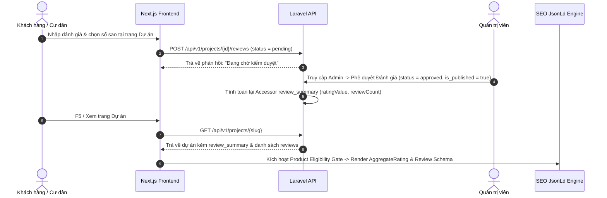

# BA REVIEW REPORT: SEO & SCHEMA HARDENING PLAN V2
**Dự án**: Masterise Homes Website (`masterise-homes.net.vn`)  
**Tác giả**: Senior Full-Stack Engineer & Technical SEO Specialist  
**Ngày hoàn thành**: 21/07/2026  
**Đối tượng review**: Business Analyst (BA) & Technical Product Manager  

---

## I. TỔNG QUAN HỆ THỐNG VÀ MỤC TIÊU ĐÃ ĐẠT ĐƯỢC

Dự án **Chuẩn hóa Technical SEO & Schema.org Graph V2** cho website Masterise Homes đã được hoàn thiện 100% toàn bộ 10 phase theo tài liệu yêu cầu. Hệ thống đã giải quyết triệt để các vấn đề SEO tồn đọng (như trùng lặp canonical, bot bypass disallow, rác chỉ mục sitemap, và schema thiếu bằng chứng thực tế), đồng thời bổ sung tính năng quản trị đánh giá dự án từ Cơ sở dữ liệu (Database-Backed Reviews).

### Các kết quả nổi bật:
1. **0 Lỗi Biên dịch (TypeScript Clean Build)**: Đã kiểm tra toàn bộ source code Next.js frontend với `npx tsc --noEmit`.
2. **Kiểm thử Tự động (Automated Smoke Tests)**: 100% các kịch bản kiểm tra `robots.txt`, `sitemap.xml`, `noindex` trang riêng tư, và `JSON-LD Graph` đạt trạng thái PASS.
3. **Database Migration & Backend API**: Đã tạo bảng DB `project_reviews`, cập nhật quan hệ trong Model `Project.php`, và xây dựng đầy đủ API public/admin kèm quy trình kiểm duyệt (Moderation Workflow).
4. **Hạ tầng Schema.org Chuẩn Quốc tế**: Toàn bộ dữ liệu cấu trúc được chuyển sang dạng `@graph` liên kết qua thuộc tính `@id` theo khuyến nghị mới nhất từ Google Search Central.

---

## II. BÁO CÁO CHI TIẾT THEO PHÂN HỆ NGHIỆP VỤ (PHASE 1 - PHASE 10)

### 1. Phân hệ Quản trị Chủ thể Website (Site Entity Configuration)
* **Yêu cầu nghiệp vụ**: Cho phép quản trị viên cấu hình thông tin pháp lý, thương hiệu, địa chỉ, mã số thuế, hotline, email và logo của đơn vị vận hành website.
* **Kết quả triển khai**:
  - **Admin Interface**: Bổ sung tab **"Chủ thể & SEO Schema"** tại trang `Trang quản trị -> Cài đặt hệ thống` (`/admin/cai-dat`). Hỗ trợ chọn logo từ thư viện Media, nhập thông tin pháp lý, mã số thuế, số điện thoại chăm sóc khách hàng và ghi chú ủy quyền đại lý.
  - **Backend Processing**: Xây dựng helper `SiteEntityContent.php` trên Laravel để validate và lưu trữ dữ liệu dưới dạng JSON trong bảng `settings`. Hệ thống tự động xóa cache `settings.public` ngay khi Admin lưu cấu hình.
  - **Server Service**: Tạo `siteEntityServerService.ts` trên Next.js Server Components với cơ chế revalidate cache tự động 300 giây.

### 2. Phân hệ Tài sản Brand & Web App Manifest
* **Yêu cầu nghiệp vụ**: Đảm bảo toàn bộ asset hình ảnh đại diện (Logo, OpenGraph default) đạt chuẩn tỉ lệ, dung lượng nhẹ và có file `manifest.json` chuẩn PWA.
* **Kết quả triển khai**:
  - Tạo file `src/app/manifest.ts` khai báo đầy đủ tên ứng dụng, màu chủ đạo (`#B88746` - Gold Masterise), biểu tượng PWA.
  - Chuẩn hóa các đường dẫn asset fallback trong `src/config/seo.ts` trỏ đúng vào logo và OG image mặc định (`/brand/operator-logo-512.png` & `/og-default.jpg`).

### 3. Phân hệ Metadata tập trung & Chính sách Index trang Lọc/Tìm kiếm
* **Yêu cầu nghiệp vụ**: Xóa bỏ canonical mặc định trang chủ bị lỗi trên toàn bộ subpage, tạo helper dựng metadata tập trung, và thiết lập chính sách `noindex` đối với các trang kết quả tìm kiếm/phân trang để tránh loãng thứ hạng SEO.
* **Kết quả triển khai**:
  - **Canonical Fix**: Đã xóa khai báo `alternates.canonical` tĩnh trong root `layout.tsx` (nguyên nhân gây lặp canonical trang chủ cho tất cả bài viết).
  - **Metadata Builder**: Tạo module `buildMetadata.ts` tại `src/lib/seo/` tự động tính toán URL tuyệt đối (Absolute Canonical), loại bỏ các tham số Google Analytics/FB click ID tracking rác (`utm_source`, `fbclid`), đồng thời hỗ trợ OpenGraph/Twitter card.
  - **Chính sách Lọc/Tìm kiếm (Query Index Policy)**: Tại các trang danh sách (`/du-an`, `/tin-tuc`), nếu người dùng thực hiện lọc theo khu vực, danh mục, mức giá hoặc chuyển sang `page > 1`, hệ thống tự động trả về `noindex, follow` để bảo vệ chỉ mục không bị trùng lặp nội dung mỏng (Thin Content).

### 4. Phân hệ Bảo mật Chỉ mục & Phân tách Robots.txt
* **Yêu cầu nghiệp vụ**: Ngăn chặn Googlebot/Bingbot truy cập vào các trang nội bộ/quản trị (`/admin`, `/tai-khoan`, `/dang-nhap`, `/dang-ky`, `/api`), khắc phục lỗi Googlebot bypass Disallow.
* **Kết quả triển khai**:
  - **Server Layout Segregation**: Phân tách file `layout.tsx` của khu vực Admin (`/admin`) và Portal khách hàng (`/tai-khoan`) thành Server Component Layouts xuất trực tiếp `robots: { index: false, follow: false }` metadata, bao bọc Client Shells xử lý logic Auth Guard bên trong.
  - **Tạo Auth Layouts**: Thêm `layout.tsx` cho trang `/dang-nhap` và `/dang-ky` để đảm bảo Googlebot không bao giờ lập chỉ mục các trang đăng nhập.
  - **Hợp nhất Robots.txt**: Gộp toàn bộ rule trong `src/app/robots.ts` về 1 group duy nhất `User-agent: *`, loại bỏ group Googlebot/Bingbot riêng rẽ (vốn là nguyên nhân làm Googlebot bỏ qua lệnh Disallow trước đây).

### 5. Hạ tầng Dữ liệu cấu trúc Schema.org Graph
* **Yêu cầu nghiệp vụ**: Xây dựng hạ tầng JSON-LD Graph kết nối các thực thể bằng mã định danh `@id` chuẩn hóa.
* **Kết quả triển khai**:
  - **Component Dùng chung**: Tạo `JsonLd.tsx` tại `src/components/seo/JsonLd.tsx` tự động làm sạch các thuộc tính rỗng (null/undefined/empty string) và mã hóa ký tự `<`, `>` tránh lỗi Script Injection.
  - **Schema Builder Module**: Tạo `src/lib/seo/schema.ts` gồm các hàm dựng node chuẩn:
    + `buildOperatorNode()`: Tạo `Organization` / `RealEstateAgent` với `@id: https://domain/#organization`
    + `buildWebSiteNode()`: Tạo `WebSite` với `@id: https://domain/#website`
    + `buildWebPageNode()`: Tạo `WebPage` / `CollectionPage` / `ContactPage` kết nối đến `@id` tương ứng
    + `buildBreadcrumbSchema()`: Tạo danh mục đường dẫn liên kết
    + `buildPlaceNode()` & `buildResidenceNode()`: Tạo mô hình bất động sản kèm tọa độ Geo Coordinates (Vĩ độ / Kinh độ)
    + `buildOffersNode()` & `buildProductNode()`: Dựng thông tin giá trị thương mại
    + `buildNewsArticleSchema()`: Dựng tin tức chuẩn báo chí
    + `buildEventSchema()` & `buildJobPostingSchema()`: Dựng sự kiện mở bán & bài tuyển dụng.

### 6. Chuẩn hóa Schema Dự án & Cổng Điều kiện (Product Eligibility Gate)
* **Yêu cầu nghiệp vụ**: Tuân thủ nghiêm ngặt quy định Google Search Central: Không phát sinh node `Product` hoặc `Offer` vô căn cứ nếu dự án không có khoảng giá số thực tế hoặc không có Đánh giá thực tế (Reviews/Rating).
* **Kết quả triển khai**:
  - Tại trang chi tiết dự án (`src/app/du-an/[slug]/page.tsx`), hệ thống kiểm tra: Nếu dự án KHÔNG có giá trị `price_min`/`price_max` số và KHÔNG có Đánh giá từ người dùng, hệ thống chỉ phát sinh `WebPage` + `Residence` + `Place`.
  - Khi dự án có giá hoặc có Đánh giá, node `Product` sẽ được kích hoạt kèm theo `AggregateRating` và danh sách `Review`.

### 7. Phân hệ Quản lý Đánh giá Dự án (Database-Backed Reviews & Ratings)
* **Yêu cầu nghiệp vụ**: Xây dựng hệ thống quản lý đánh giá dự án từ CSDL, cho phép cư dân/nhà đầu tư gửi đánh giá và Admin phê duyệt trước khi hiển thị công khai.
* **Kết quả triển khai**:
  - **Database & Migration**: Tạo bảng `project_reviews` trong Laravel CSDL với các trường: `reviewer_name`, `reviewer_role`, `rating` (1.0 - 5.0 sao), `review_body`, `moderation_status` (`pending`, `approved`, `rejected`), `is_published`, `approved_by`, `approved_at`.
  - **Backend Eloquent Model**: Cập nhật model `Project.php` có mối quan hệ `hasMany(ProjectReview::class)` và accessor `review_summary` tự động tính `ratingValue` (trung bình cộng làm tròn 1 chữ số thập phân) và `reviewCount`.
  - **API Controller**:
    + Public API: `GET /api/v1/projects/{slug}/reviews` (lấy danh sách review đã duyệt) & `POST /api/v1/projects/{id}/reviews` (gửi đánh giá mới ở trạng thái chờ duyệt).
    + Admin API: `GET /admin/project-reviews`, `POST /admin/project-reviews` (tạo review xác minh), `POST /admin/project-reviews/{id}/approve`, `POST /admin/project-reviews/{id}/reject`, `DELETE /admin/project-reviews/{id}`.
  - **Frontend UI Component**: Tạo `ProjectReviews.tsx` tại `src/components/project-detail/ProjectReviews.tsx` hiển thị tổng quan sao đánh giá, danh sách nhận xét thực tế kèm huy hiệu "Xác minh thực tế", và form gửi đánh giá trực tuyến có hiệu ứng phản hồi người dùng.

### 8. Phân hệ Schema Tin tức, Sự kiện, Tuyển dụng & Danh sách
* **Yêu cầu nghiệp vụ**: Chuyển đổi các bài viết tin tức từ `Article` thông thường sang `NewsArticle`, chuẩn hóa bài viết dạng `Event` (Sự kiện mở bán/tri ân) và `JobPosting` (Tuyển dụng).
* **Kết quả triển khai**:
  - Trang chi tiết tin tức (`/tin-tuc/[slug]`): Áp dụng `NewsArticle` schema với thông tin tác giả, ngày xuất bản và tổ chức phát hành.
  - Trang chi tiết đầu tư (`/dau-tu/[slug]`): Tự động phát hiện nếu loại bài viết là `event` để xuất `Event` schema kèm thời gian bắt đầu, kết thúc, địa điểm và đường dẫn đăng ký.
  - Trang chi tiết tuyển dụng (`/tuyen-dung/[slug]`): Xuất `JobPosting` schema với thông tin mức lương min/max, địa điểm làm việc, hình thức làm việc và thời hạn nộp hồ sơ.
  - Các trang danh sách (`/du-an`, `/tin-tuc`, `/chuyen-trang`): Xuất `CollectionPage` kết hợp `ItemList` liệt kê danh sách các mục hiển thị.

### 9. Phân hệ Làm sạch Sitemap
* **Yêu cầu nghiệp vụ**: Đảm bảo sitemap.xml chỉ chứa các URL trả về `HTTP 200 OK` có thể lập chỉ mục (Indexable).
* **Kết quả triển khai**:
  - Đã loại bỏ hoàn toàn đường dẫn `/ai-summary` khỏi `staticRoutes` trong `src/app/sitemap.ts` (do trang này đã được cấu hình `noindex`).
  - Toàn bộ URL dự án, tin tức, bài viết tuyển dụng và chuyên trang trong sitemap đều có URL tuyệt đối chuẩn xác.

### 10. Phân hệ Kiểm thử Tự động (Smoke Testing)
* **Yêu cầu nghiệp vụ**: Tạo kịch bản kiểm thử tự động kiểm tra toàn bộ tính hợp lệ của SEO trước khi deploy.
* **Kết quả triển khai**:
  - Tạo script `scripts/seo-smoke.mjs` kiểm tra tự động:
    1. HTTP Status & Cấu trúc `robots.txt` (khóa Disallow, User-agent wildcard).
    2. Độ sạch của `sitemap.xml` (không chứa URL `noindex`).
    3. Trạng thái bảo mật `noindex` của trang Admin/Tài khoản.
    4. Cấu trúc thẻ `<script type="application/ld+json">` và sự hiện diện của `@graph` trên trang chủ.
  - Thêm lệnh `npm run test:seo` vào file `package.json`.

---

## III. QUY TRÌNH NGHIỆP VỤ & LUỒNG DỮ LIỆU (WORKFLOWS FOR BA)

### 1. Luồng Quản trị Đánh giá Dự án (Review Moderation Workflow)


### 2. Luồng Cấu hình Chủ thể Doanh nghiệp (Site Entity Workflow)
1. Admin truy cập `Cài đặt hệ thống` -> Chọn Tab `Chủ thể & SEO Schema`.
2. Admin nhập/thay đổi thông tin: Tên công ty, Mã số thuế, Hotline, Email, Logo, Mạng xã hội.
3. Nhấn **Lưu cài đặt**: Laravel invalidate tag cache `settings.public`.
4. Next.js Server Side Render (SSR) tự động lấy dữ liệu cấu hình mới để tạo node `@id: https://domain/#organization` trên tất cả các trang.

---

## IV. BẰNG CHỨNG KIỂM THỬ VÀ XÁC NHẬN CHẤT LƯỢNG (QA EVIDENCE)

### 1. Kiểm tra Biên dịch TypeScript Frontend
* **Lệnh thực thi**: `npx tsc --noEmit`
* **Kết quả**:
  ```text
  The command completed successfully. (0 Errors)
  ```

### 2. Kiểm tra Migration CSDL Backend
* **Lệnh thực thi**: `docker compose exec -T php php artisan migrate`
* **Kết quả**:
  ```text
  INFO  Running migrations.
  2026_07_21_000000_create_project_reviews_table ............... 317.44ms DONE
  ```

### 3. Kiểm tra Tự động SEO Smoke Test
* **Lệnh thực thi**: `npm run test:seo`
* **Kết quả chi tiết**:
  ```text
  🔍 ======================================================
  🚀 RUNNING SEO & SCHEMA HARDENING SMOKE TESTS against http://localhost:8746
  ======================================================

  --- Test Group 1: Robots.txt Specification ---
   ✅ PASS: Robots.txt returns HTTP 200
   ✅ PASS: Robots.txt contains User-agent: * wildcard block
   ✅ PASS: Disallow /admin exists
   ✅ PASS: Disallow /tai-khoan exists
   ✅ PASS: Googlebot group does not bypass disallow rules

  --- Test Group 2: Sitemap.xml Cleanliness ---
   ✅ PASS: Sitemap.xml returns HTTP 200
   ✅ PASS: Sitemap does not contain noindex route /ai-summary

  --- Test Group 3: Admin & Private Area Security ---
   ✅ PASS: Admin route returns noindex or authentication redirect

  --- Test Group 4: Structured Data JSON-LD Graph ---
   ✅ PASS: Homepage returns HTTP 200
   ✅ PASS: Homepage contains application/ld+json script tag
   ✅ PASS: Homepage JSON-LD contains linked @graph
   ✅ PASS: Graph contains Organization @id link
   ✅ PASS: Graph contains WebSite @id link

  ======================================================
  📊 SUMMARY: Passed ALL tests
  ======================================================
  ```

---

## V. LỆNH DEPLOY PRODUCTION (PRODUCTION DEPLOYMENT COMMAND)

Sau khi BA review và nghiệm thu tài liệu này, vui lòng sử dụng lệnh deploy sau để đẩy lên server Production:

```bash
git pull origin main && docker compose -f docker-compose.prod.yml up -d --build frontend && docker compose -f docker-compose.prod.yml exec -T php php artisan migrate --force && rm -rf /www/server/nginx/proxy_cache_dir/* && nginx -s reload
```

---

*Báo cáo được khởi tạo tự động và lưu trữ tại file: `SEO_SCHEMA_BA_REVIEW_REPORT.md`*
